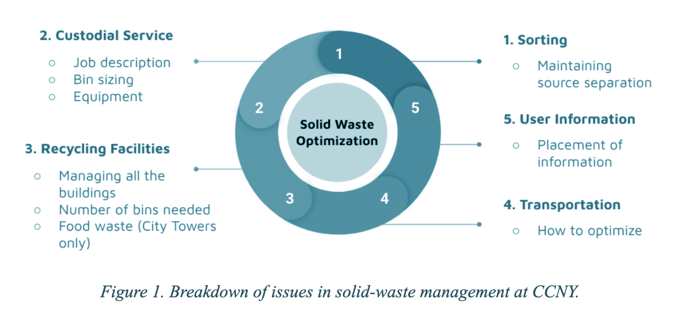
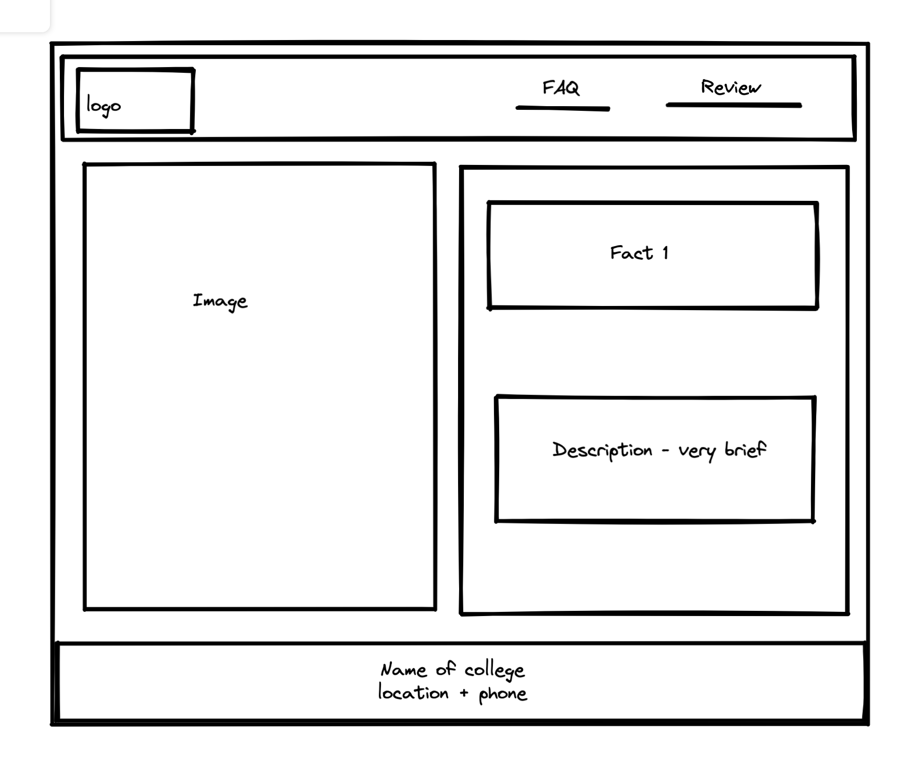
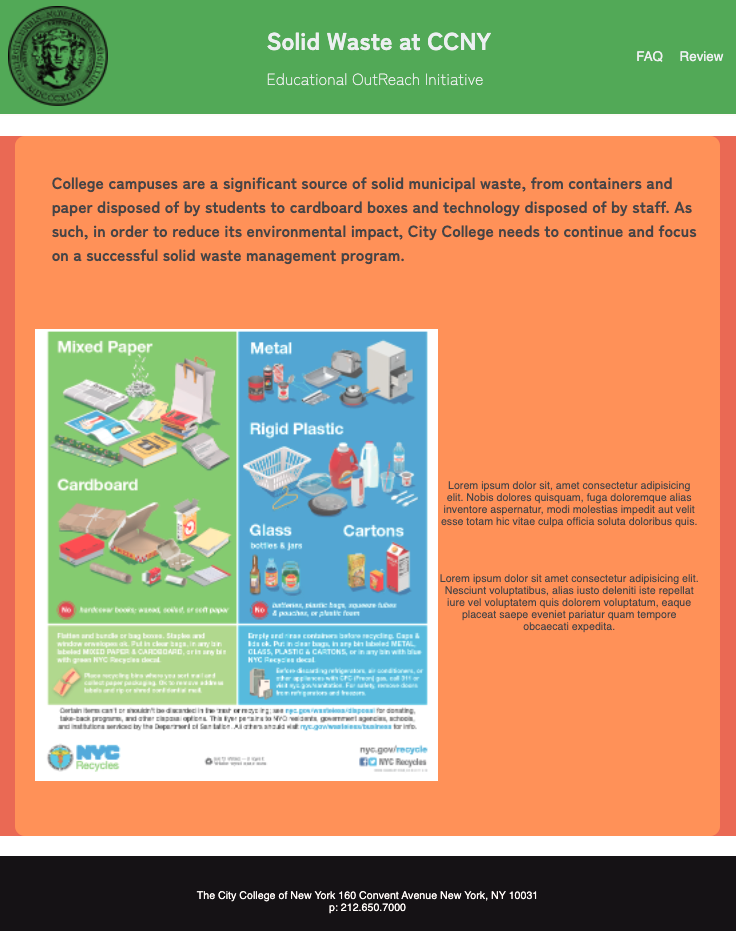
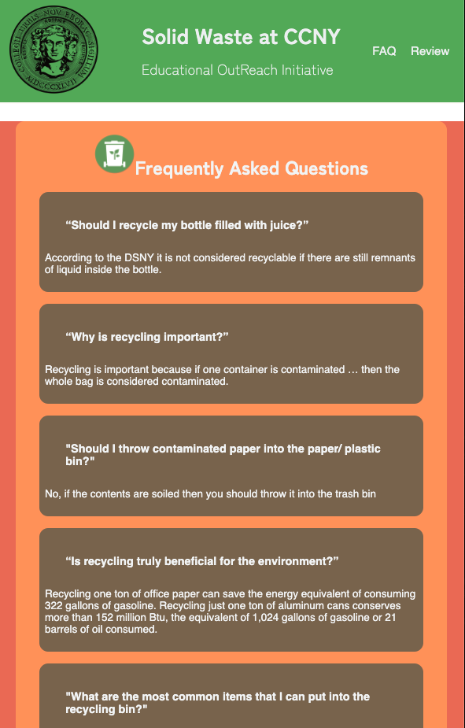
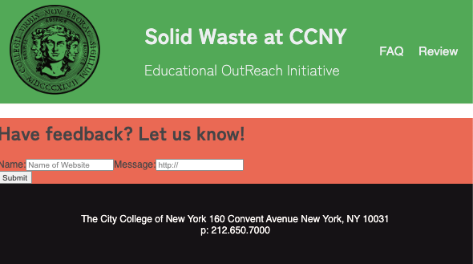

#  `What is this for?`
This is for a senior design project at the City College of New York. Created a flyer that contains a QR code to the following link. This "website" is part of an educational outreach initiative at a CUNY to raise awareness and/or encourage recycling.

The solid waste management program of CCNY is complex and multifaceted. There is a chain of participants and processes; the individual disposes of their waste, the custodial staff collects it and places it in the proper container, then external companies transport it to the proper facility. Improving any point of this process would result in the optimisation of the overall solid waste management system.

It is, therefore, necessary that the process of solid waste management be optimized in order to work best with the college’s available resources. 

This project was bootstrapped with [Create React App](https://github.com/facebook/create-react-app).

## Why is an educational effort important?

An educational effort plays an important role in the “Solid Waste Management Plan”, as the effort promotes the continuation of proper disposal at recycling stations. Executing a successful educational campaign will help faculty, students, and staff recognize the role that they play within the solid waste process. The educational campaign will advise individuals to make certain changes regarding consumer waste disposal. This will facilitate an understanding and establish communication with other faculty and students. A website containing the information stated above will be placed nearby CCNY recycling stations. Individuals will be able to access the site using a QR code. Additionally, pamphlets with information will be placed inside faculty departments to encourage proper disposal of solid waste.

### `How to view the page?`

Students and faculty can scan the QR code which will lead to the following educational program.
Click the link here ---> [http://localhost:3000](http://localhost:3000) to view.

## `How did we start and what did the process look like?`

Initially started with creating a wireframe to get a general overview of the website structure. Here is the wireframe that the homepage was modelled after . After wireframing we chose a range of colors to work with and had a color scheme in mind.

## `How does the page look after a couple of edits?`
Once the wireframe was completed we used react hooks to display colors and components. We used react-router-dom to change the URL links and allow users to change the page via navbar link. The following is the home page.
### Home Page 
.

### FAQ Page
.

### Review Page
.

## `What I learned from this project? And challenges I encountered.`
